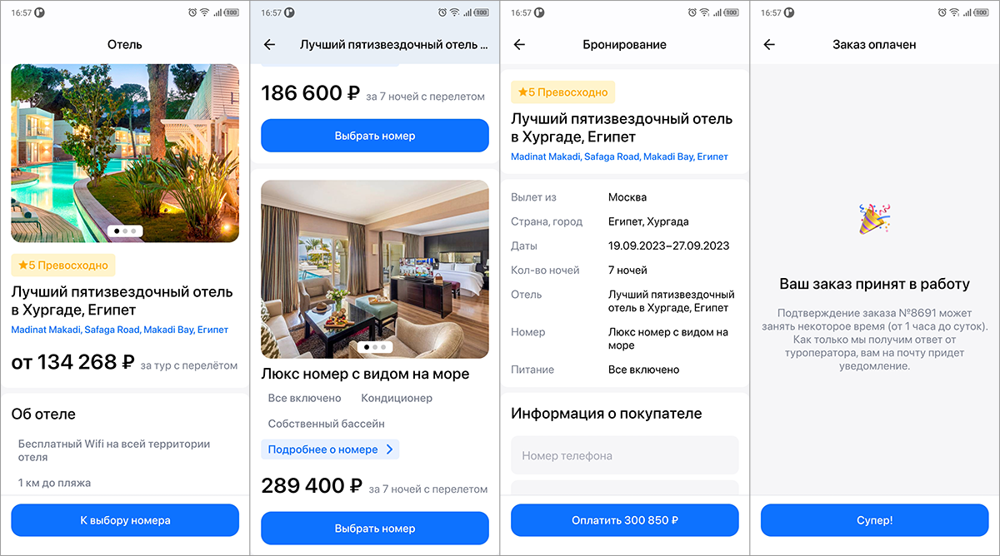

# Flutter Hotel Booking Demo App

Реализация [тестового задания](https://docs.google.com/document/d/1Q6xeuY-fbzrlp075NnxlGCK9m56Ag7rbg35c8O-RM7s/edit) вёрстки и функционала нескольких экранов приложения для бронирования номеров в отелях.

### Исходные условия
- Макеты экранов предоставлены в Figma
- Данные для работы приложение получает по предоставленному REST API

### Используемые инструменты
- Flutter
- GoRouter
- BLoC (Cubit)
- Retrofit
- Подход Clean Architecture

### Скриншоты

### Видео работы приложения
[→ Смотреть](https://drive.google.com/file/d/1kDAyTl9yVmmd4uSQtxs9M--078dkimdT/view)
